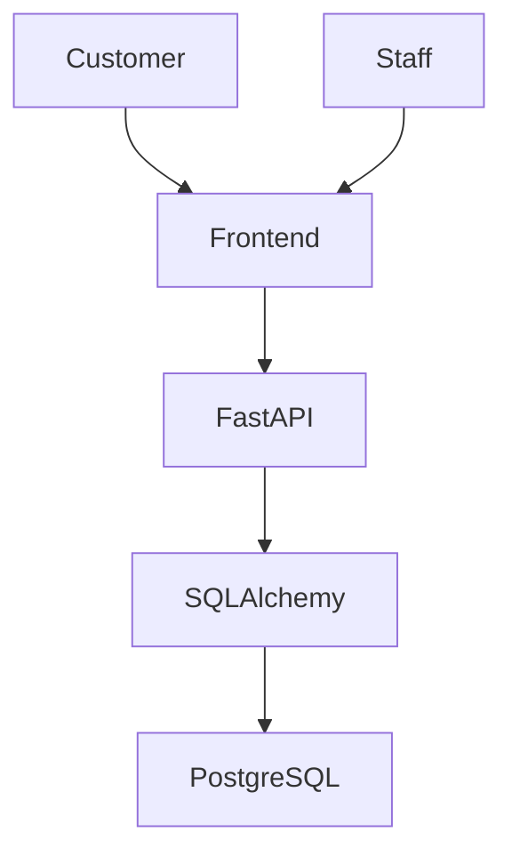
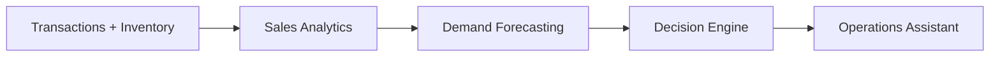
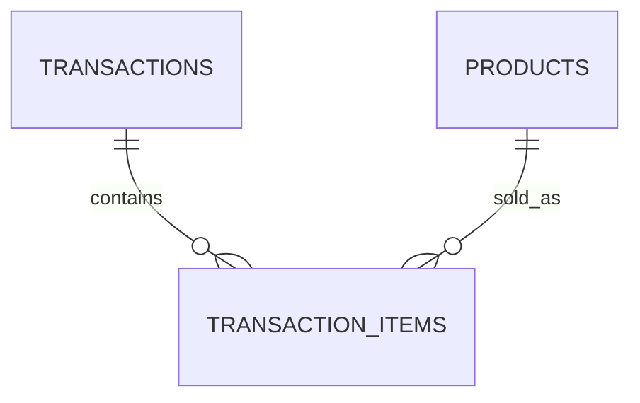

# Retail Intelligence Platform

A full-stack retail operations and intelligence platform designed to help stores move beyond basic transaction and inventory tracking toward data-driven demand forecasting and operational decision-making.

**Status:** In Progress. The retail foundation, synthetic sales-data pipeline, and sales analytics are working; demand forecasting and the decision layer are being built on top.

**Stack:** React · TypeScript · Vite · FastAPI · SQLAlchemy · PostgreSQL

## Problem

Retail stores often rely on current inventory levels and historical sales records without fully accounting for how demand changes throughout the day. This can lead to:

- Popular products running out during periods of heavy demand.
- Low-stock items not being identified early enough.
- Inventory decisions being made without considering when demand is expected to peak.
- Staff reacting to stock problems after they occur instead of anticipating them.

## Solution

The platform is built around turning raw retail activity into an operational feedback loop:

**Observe → Predict → Decide → Act → Measure → Learn**

It combines transaction history, inventory state, time-based demand patterns, and forecasting to identify upcoming risks and recommend operational actions.

The current system provides the transactional, inventory, and sales-analytics foundation for this approach, while forecasting and the decision layer are being developed on top of it.

## Current Status

| Area | Status |
|---|---|
| Customer workflow (browse, cart, checkout) | Working |
| Staff workflow (inventory visibility, transaction history) | Working |
| Transactional checkout with stock validation and rollback | Working |
| Low-stock detection | Working |
| Synthetic historical sales-data pipeline | Working |
| Sales analytics (revenue, transactions, units sold, top products, hourly and daily sales) | Working |
| Demand forecasting | Planned |
| Decision engine | Planned |
| Operations assistant | Planned |

## Screenshots

Screenshots will be added as the customer and staff interfaces are polished.

## Features

### Customer

- Product browsing
- Cart management with quantity controls
- Checkout

### Staff

- Inventory visibility
- Low-stock detection
- Transaction history

### Backend

- Product management and lookup
- Transactional checkout
- Stock validation and inventory deduction
- Transaction history retrieval
- Synthetic historical sales-data generation
- Sales analytics computed from transaction data (see [Sales Analytics](#sales-analytics))

## How It Works

The application follows a simple full-stack architecture:



The intelligence layer is being built on top of the transactional data:



**Built today:** Customer and staff workflows, transactional checkout, inventory management, transaction history, synthetic historical sales data, and sales analytics.

**In development / planned:** Demand forecasting → Decision engine → Operations assistant.

## Data Model

The core data model consists of:

- **Products** — product information and current inventory.
- **Transactions** — completed sales with totals and timestamps.
- **Transaction Items** — products, quantities, and sale prices belonging to each transaction.



This structure supports both transaction-level reporting and product-level sales analysis.

## Synthetic Sales Data

A new retail system does not have enough historical data to develop forecasting immediately. The project therefore includes a synthetic sales-data pipeline for development and testing.

The generated data models:

- Different product demand levels
- Product-specific demand behavior
- Day-to-day variation
- Time-of-day patterns
- Stronger evening and night demand for relevant products
- Variable transaction basket sizes

> **Note:** This data is synthetic. It is used to develop and test sales analytics and forecasting and does not represent a real store.

## Sales Analytics

Sales analytics are computed from the existing `transactions` and `transaction_items` tables using FastAPI, SQLAlchemy, and PostgreSQL. The analytics provide:

- Total revenue
- Total number of transactions
- Total units sold
- Top-selling products
- Sales by hour
- Daily sales

The current development dataset contains 25 products, 2,934 transactions, 5,681 transaction line items, and 30 days of synthetic historical sales data.

> **Note:** These figures come from the synthetic dataset, so they demonstrate the analytics pipeline rather than the results of a real store.

## Technology Stack

| Layer | Technology |
|---|---|
| Frontend | React, TypeScript, Vite |
| Backend | Python, FastAPI, Uvicorn |
| ORM | SQLAlchemy |
| Database | PostgreSQL |
| Communication | REST APIs |
| Development | Git, GitHub, VS Code |

## Getting Started

### Prerequisites

- Python 3.10+
- Node.js and npm
- PostgreSQL
- An empty PostgreSQL database, such as `retail_intelligence`

### Backend

From the project root:

```powershell
cd backend
python -m venv .venv
.\.venv\Scripts\Activate.ps1
```

Install dependencies:

```powershell
pip install -r requirements.txt
```

Create `backend/.env`:

```text
DB_USER=your_user
DB_PASSWORD=your_password
DB_HOST=localhost
DB_PORT=5432
DB_NAME=retail_intelligence
```

Start the backend:

```powershell
uvicorn main:app --reload
```

API:

```text
http://localhost:8000
```

Swagger documentation:

```text
http://localhost:8000/docs
```

### Frontend

In a separate terminal:

```powershell
cd frontend
npm install
npm run dev
```

### Synthetic Demo Data

From the project root:

```powershell
backend\.venv\Scripts\python.exe backend\seed_demo_data.py --write --seed 42 --days 30
```

The generated sales data is stored in PostgreSQL and is used by the sales analytics and will be used to develop the forecasting components.

## Roadmap

### Completed

- [x] Sales analytics

### In Progress

- [ ] Demand pattern analysis by product and time of day

### Up Next

- [ ] Demand forecasting
- [ ] Stockout-risk identification based on predicted demand
- [ ] Decision engine recommending inventory actions

### Later

- [ ] Operations assistant for operational questions and priorities
- [ ] Operational context, such as immediately available stock versus back-stock
- [ ] Feedback loop to evaluate whether recommendations were useful

## Design Decisions

- **Transactional foundation first.** The project establishes reliable transaction and inventory data before building intelligence on top of it.
- **Synthetic data before forecasting.** A controlled historical dataset allows analytics and forecasting to be developed without waiting for real store data.
- **Layered intelligence.** Analytics, forecasting, decisions, and the operations assistant are separate stages so each can be developed and evaluated independently.

## Project Structure

```text
retail-intelligence-platform/
├── backend/
│   ├── main.py
│   ├── database.py
│   ├── models.py
│   ├── schemas.py
│   └── seed_demo_data.py
├── frontend/
│   └── src/
├── docs/
│   └── architecture/
├── .gitignore
└── README.md
```

## Author

**Aarush Nag**

B.Tech in Electronics and Computer Engineering, Manipal Academy of Higher Education

[LinkedIn](https://linkedin.com/in/aarush-nag)
