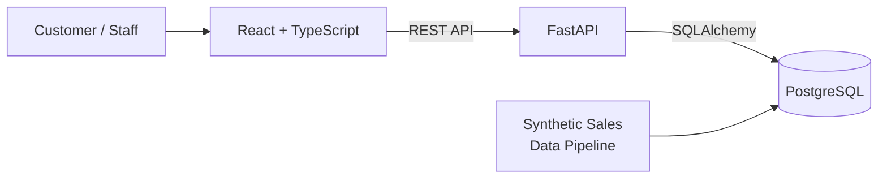
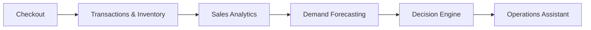

# Retail Intelligence Platform

A full-stack retail operations and intelligence platform designed to help stores move beyond basic transaction and inventory tracking toward data-driven demand forecasting and operational decision-making.

**Status:** In Progress. The retail foundation and a synthetic sales-data pipeline are working; the intelligence layer is being built on top, starting with sales analytics. See the [Roadmap](#roadmap).

## Problem

Retail stores often rely on current inventory levels and historical sales records without fully accounting for how demand changes throughout the day. This can lead to:

- Popular products running out during periods of heavy demand.
- Low-stock items not being identified early enough.
- Inventory decisions made without considering when demand is expected to peak.
- Staff reacting to stock problems after they occur instead of anticipating them.

## Solution

The platform is built around turning raw retail activity into an operational feedback loop:

**Observe → Predict → Decide → Act → Measure → Learn**

It combines transaction history, inventory state, time-based demand patterns, and forecasting to identify upcoming risks and recommend operational actions. The current system provides the transactional and inventory foundation for this approach, and the intelligence layer is being developed on top of it.

## Current Status

| Area | Status |
|---|---|
| Customer workflow (browse, cart, checkout) | Working |
| Staff workflow (inventory visibility, transaction history) | Working |
| Transactional checkout with stock validation and rollback | Working |
| Low-stock detection | Working |
| Synthetic historical sales-data pipeline | Working |
| Sales analytics | In development |
| Demand forecasting | Planned |
| Decision engine | Planned |
| Operations assistant | Planned |

## Features

**Customer side**
- Product browsing, cart management, and checkout

**Staff side**
- Inventory visibility with status and low-stock detection
- Transaction history showing each sale with its individual products

**Backend**
- Product management and lookup
- Transactional checkout: stock validation, transaction creation, transaction-item persistence, and inventory deduction succeed or fail together
- Database rollback on checkout errors, so a failed checkout never leaves stock or transactions half-updated
- Transaction history retrieval, returning transactions with their items and product information

## How It Works

The application is split into customer and staff workflows that share one backend and database.



The intelligence layer is planned as a pipeline on top of the same data:



**Built today:** Checkout → Transactions & Inventory, plus the synthetic data feeding the same database.
**In development / planned:** Sales Analytics → Demand Forecasting → Decision Engine → Operations Assistant.

## Data Model

A sale is stored at two levels so the system can answer both "what was the total?" and "what exactly was sold?":

- **Transaction:** one complete sale, with its total and timestamp.
- **Transaction item:** one product line within a sale, with the product, quantity, and sale price at the time.

This separation keeps transaction history readable and makes product-level analysis, such as demand per product over time, straightforward. Products and their inventory levels are the other core entities.

## Synthetic Sales Data

Forecasting needs a meaningful history, which a new system doesn't have. The project includes a pipeline that generates realistic sales data and stores it in PostgreSQL. It models:

- Different product demand levels
- Product-specific demand behavior
- Day-to-day variation
- Time-of-day patterns, including stronger evening and night demand

> **Note:** This data is synthetic. It exists to develop and test sales analysis and forecasting, and does not represent a real store.

## Tech Stack

| Layer | Technology |
|---|---|
| Frontend | React, TypeScript |
| Backend | Python, FastAPI, Uvicorn |
| ORM | SQLAlchemy |
| Database | PostgreSQL |
| Communication | REST APIs |

## Getting Started

> Update the commands below to match your repository's actual folder names and scripts.

**Prerequisites:** Python 3.10+, Node.js and npm, PostgreSQL

```bash
# 1. Clone
git clone https://github.com/<your-username>/<repo-name>.git
cd <repo-name>

# 2. Create the database
createdb retail_platform

# 3. Backend
cd backend
python -m venv venv
source venv/bin/activate        # Windows: venv\Scripts\activate
pip install -r requirements.txt
```

Create `backend/.env`:

```env
DATABASE_URL=postgresql://<user>:<password>@localhost:5432/retail_platform
```

```bash
uvicorn app.main:app --reload

# 4. Frontend (new terminal)
cd frontend
npm install
npm run dev

# 5. Optional: generate synthetic sales data
python scripts/generate_sales_data.py
```

**API docs:** with the backend running, open Swagger UI at `http://localhost:8000/docs`.

## Roadmap

**Done**
- [x] Customer workflow: browse, cart, checkout
- [x] Staff workflow: inventory visibility and transaction history
- [x] Transactional checkout with stock validation and rollback
- [x] Transaction / transaction-item data model
- [x] Low-stock detection
- [x] Synthetic historical sales-data pipeline

**In progress**
- [ ] Sales analytics (demand patterns by product and time of day)

**Planned**
- [ ] Demand forecasting
- [ ] Stockout-risk identification based on predicted demand
- [ ] Decision engine recommending inventory actions
- [ ] Operations assistant for questions like which products will be needed, which inventory risks need attention, and what to prioritize now
- [ ] Operational context, such as immediately available stock versus back-stock
- [ ] Feedback loop that measures whether recommendations were useful and improves them

## Design Decisions

- **Transactions and items are separate.** Totals and timestamps live apart from product lines, which keeps history readable and per-product analysis simple.
- **Checkout is transactional.** Validation, record creation, and inventory deduction succeed or fail together, with rollback on error, so inventory never drifts from sales.
- **Synthetic data comes first.** Building the data pipeline before the models lets forecasting be developed without waiting for real sales history.
- **Intelligence is layered.** Analytics, forecasting, decisions, and the assistant are separate stages that can be built and tested one at a time.

## Author

**Aarush Nag**, B.Tech in Electronics and Computer Engineering, Manipal Academy of Higher Education
[LinkedIn](https://linkedin.com/in/aarush-nag) | aarushnag27@gmail.com
